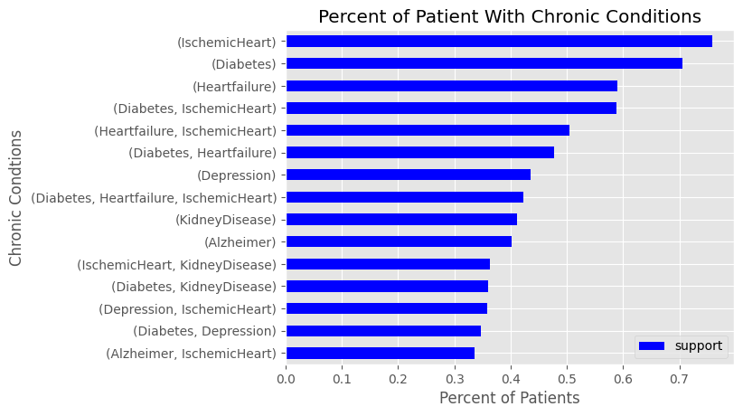
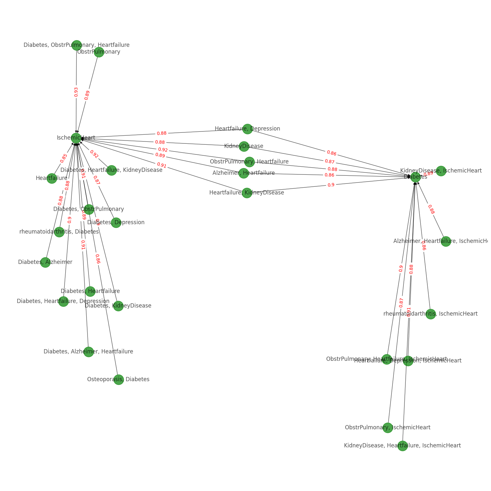
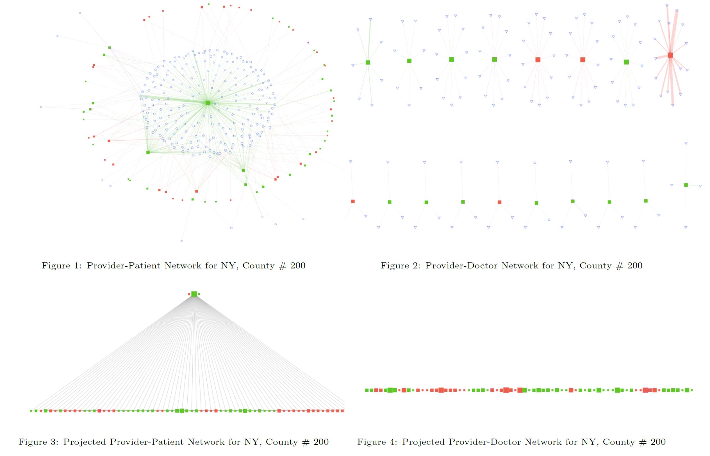

# Master Portfolio Project

This is my repository for the master portfolio project at Duke Statistical Science, defended in early April 2024. It focuses on medicare billing fraud detection using
* predictive modeling (Python)
* associate rule mining (Python)
* network analysis (R)

I'm detecting 
* Duplicate billings
* Phantom billings
* Upcoding
* Unbundling

**Datasets cannot be disclosed due to sensitivity reasons.**

## Predictive Modeling

**Tools:** Logistic Regression, Random Forest, AdaBoost, XGBoost, LightGBM

## Associate Rule Mining

**Tools:** Apriori algorithm

## Network Analysis

**Tools:** `igraph` in `R`

